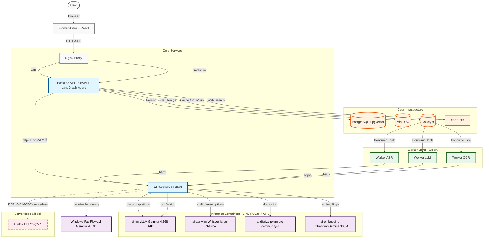

# 시스템 전체 조감도 (System Architecture Overview)

현재 시스템의 모든 컴포넌트와 데이터/요청 흐름을 보여주는 조감도입니다.
상세 문서는 [`docs/architecture-v1.2.0.md`](docs/architecture-v1.2.0.md) 참조.

---

## 컴포넌트 설명

### 1. Core Services
- **Nginx**: 모든 트래픽의 진입점 (SSL termination, /api → backend, /socket.io → backend WS).
- **Backend (FastAPI + LangGraph Agent)**: 비즈니스 로직, DB/S3 연동, 작업 큐(Valkey) 적재, AI 채팅 (LangGraph 9 노드 · 6 도구 · 5 모드).
- **AI Gateway (FastAPI + httpx)**: 추론 라우터. tier 기반 모델 매핑(`tier-simple` / `tier-standard` / `tier-thinking`), `DEPLOY_MODE=local-gpu` 시 컨테이너 직결, `serverless` 시 Codex/RunPod 폴백. 이전의 LiteLLM Proxy + Provider Manager(Host PM2)는 v1.2.0에서 폐기.

### 2. Worker Layer (Celery)
- **OCR Worker**: PDF/이미지 전처리 후 ai-gateway → ai-llm(Gemma 4 vision) 호출.
- **ASR Worker**: 오디오 파일 변환(FFmpeg) 후 ai-gateway → ai-asr-vllm(Whisper-large-v3-turbo) → 후처리 + 화자분리(ai-diarize pyannote).
- **LLM Worker**: 요약·구조화 작업, ai-gateway → ai-llm(vLLM Gemma 4) 호출.

### 3. Inference Containers (ai-* prefix)
모두 Docker 컨테이너로 운영한다. LLM·ASR·화자분리는 ROCm iGPU를, 임베딩은 CPU를 사용하며 HF 모델은 `hf-cache-fast` named volume을 공유한다.

| 컨테이너 | 모델 | 백엔드 |
|---------|------|--------|
| `ai-llm` | Gemma 4 26B A4B AWQ INT4 + MTP k=4 | vLLM 0.26 (32K context) |
| `ai-asr-vllm` | Whisper-large-v3-turbo | vLLM |
| `ai-diarize` | pyannote community-1 | pyannote-audio (ROCm) |
| `ai-embedding` | EmbeddingGemma 300M Q4 GGUF | llama.cpp CPU |

`tier-simple`은 Windows 호스트 FastFlowLM의 Gemma 4 E4B를 우선 호출하고 실패 시
`ai-llm`의 Gemma 4 A4B로 fallback한다. 나머지 tier와 OCR은 `ai-llm`을 사용한다.

### 4. Data Layer
- **PostgreSQL + pgvector**: 사용자/콘텐츠/대화 영속화 + 벡터 임베딩 인덱스.
- **MinIO (S3-compatible)**: 파일·미디어 저장소.
- **Valkey 9 (Redis-compatible)**: 캐시, 동시성 세마포어, Pub/Sub 이벤트 버스. (v1.1.0의 추론용 Redis Stream은 v1.2.0에서 사용 안 함)
- **SearXNG**: 메타 웹 검색 (LangGraph 검색 노드).

### 5. Serverless Fallback
- **Codex (CLIProxyAPI)**: `DEPLOY_MODE=serverless` 또는 명시적 fallback 시 OAuth CLI Proxy 경유.
