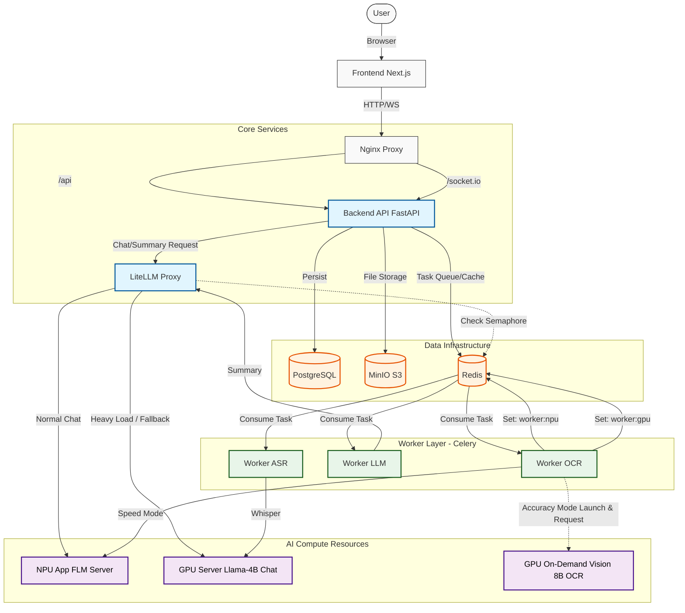

# 시스템 전체 조감도 (System Architecture Overview)

현재 시스템의 모든 컴포넌트와 데이터/요청 흐름을 보여주는 조감도입니다.

---

## 컴포넌트 설명

### 1. **Core Services**
- **Nginx**: 모든 트래픽의 진입점.
- **Backend (FastAPI)**: 비즈니스 로직, DB/S3 연동, 작업 큐(Redis) 적재.
- **LiteLLM**: LLM 요청의 "교통경찰". 세마포어(GPU/NPU 사용 여부)를 확인하여 라우팅.

### 2. **Worker Layer (Celery)**
- **OCR Worker**:
  - **Speed 모드**: NPU(FLM) 사용, `worker:npu` 세마포어 점유.
  - **Accuracy 모드**: GPU 전용 8B Vision 모델을 **일시적으로(On-Demand) 실행**하고 종료. `worker:gpu` 세마포어 점유.
- **ASR/LLM Worker**: 오디오 및 요약 작업 담당.

### 3. **AI Compute Resources**
- **NPU (FLM)**: 상시 실행 (채팅/빠른OCR).
- **GPU (Default)**: 상시 실행 (채팅 백업/Llama-4B).
- **GPU (On-Demand)**: 필요 시에만 실행 (정밀OCR/Vision 8B/Port 8082).
