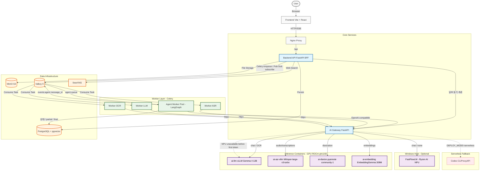

# 시스템 전체 조감도 (System Architecture Overview)

현재 시스템의 모든 컴포넌트와 데이터/요청 흐름을 보여주는 조감도입니다.
상세 문서는 [`docs/architecture-v1.2.0.md`](docs/architecture-v1.2.0.md) 참조.

---

## 컴포넌트 설명

### 1. Core Services
- **Nginx**: 모든 트래픽의 진입점 (SSL termination, /api → backend, /socket.io → backend WS).
- **Backend (FastAPI BFF)**: 인증, DB/S3 연동, Celery 작업 접수, Agent Worker의 Pub/Sub 이벤트를 SSE로 relay. LangGraph를 요청 프로세스에서 직접 실행하지 않음.
- **AI Gateway (FastAPI + httpx)**: `RoutingProfile(workload, reasoning, execution_scope)`과 Provider health/circuit/capacity를 기준으로 NPU/GPU/Codex를 선택. `DEPLOY_MODE=serverless`에서는 RunPod/Codex를 사용. 이전의 LiteLLM Proxy + Provider Manager(Host PM2)는 폐기.

### 2. Worker Layer (Celery)
- **Agent Worker**: `agent` 큐를 소비해 LangGraph를 실행하고, PostgreSQL에 상태/partial/final을 저장하면서 `events:agent:{message_id}`로 실시간 이벤트 발행. 기본 동시성은 1이며 `AGENT_WORKER_CONCURRENCY`로 조절.
- **OCR Worker**: PDF/이미지 전처리 후 ai-gateway → ai-llm(Gemma 4 vision) 호출.
- **ASR Worker**: 오디오 파일 변환(FFmpeg) 후 ai-gateway → ai-asr-vllm(Whisper-large-v3-turbo) → 후처리 + 화자분리(ai-diarize pyannote).
- **LLM Worker**: 요약·구조화 작업, ai-gateway → ai-llm(vLLM Gemma 4) 호출.

### 3. Inference Containers (ai-* prefix)
모두 Docker 컨테이너로 운영, ROCm 6.x + AMD Radeon 890M(gfx1150) iGPU 사용. HF 모델은 `hf-cache-fast` named volume 공유.

| 컨테이너 | 모델 | 백엔드 |
|---------|------|--------|
| `ai-llm` | Gemma 4 12B | vLLM |
| `ai-asr-vllm` | Whisper-large-v3-turbo | vLLM |
| `ai-diarize` | pyannote community-1 | pyannote-audio (ROCm) |
| `ai-embedding` | EmbeddingGemma 308M Q4 GGUF | llama.cpp HIP |
| Windows Host(선택) | `gemma4-it:e2b` | FastFlowLM (Ryzen AI NPU) |

### 4. Data Layer
- **PostgreSQL + pgvector**: 사용자/콘텐츠/대화 영속화 + 벡터 임베딩 인덱스.
- **MinIO (S3-compatible)**: 파일·미디어 저장소.
- **Valkey 9 (Redis-compatible)**: Celery broker, 캐시, 분산 락, Pub/Sub 이벤트 버스. 응답 토큰은 Stream에 쌓지 않으며, v1.1.0의 추론용 Redis Stream은 사용하지 않음.
- **SearXNG**: 메타 웹 검색 (LangGraph 검색 노드).

### 5. Serverless Fallback
- **Codex (CLIProxyAPI)**: `DEPLOY_MODE=serverless` 또는 명시적 fallback 시 OAuth CLI Proxy 경유.

### 6. 채팅 스트리밍과 복구
- `POST /api/threads`와 `POST /api/threads/{thread_id}/messages`에 `stream: true`를 보내면 첫 SSE 이벤트로 `accepted`를 받은 뒤 같은 연결에서 토큰을 수신.
- `accepted` 이후 연결만 끊기면 Frontend가 동일 `message_id`의 GET SSE에 0/1/2/5초(±20% jitter) 간격으로 최대 4회 재연결.
- Pub/Sub 누락은 PostgreSQL의 5초 partial snapshot과 최종 응답 조회로 복구. `accepted` 이전 POST는 중복 생성 위험 때문에 자동 재시도하지 않음.
