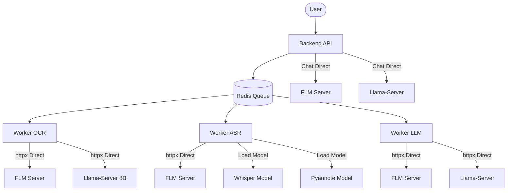
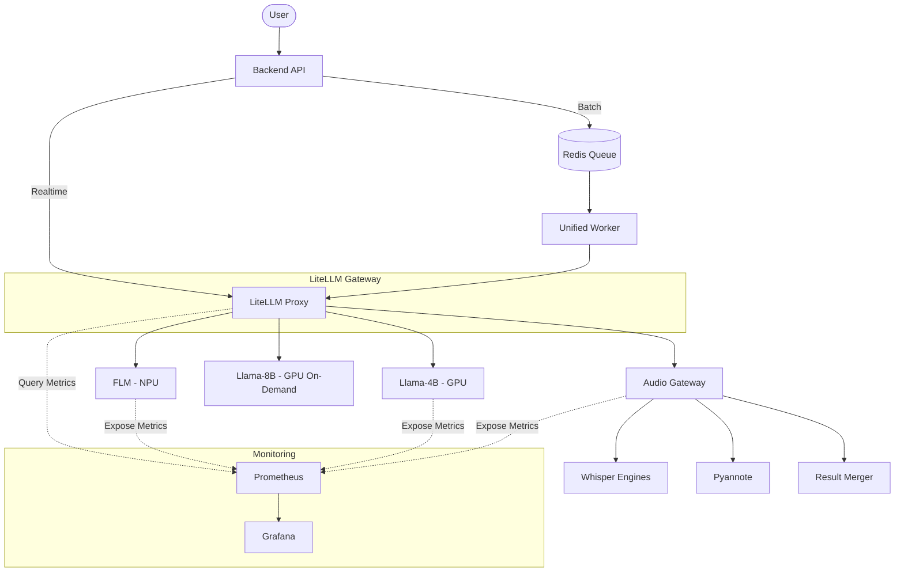

# 아키텍처 전후 비교: LiteLLM 도입

## 개요

이 문서는 LiteLLM 도입 전(Legacy)과 도입 후(V4) 시스템 아키텍처를 비교합니다.

---

# BEFORE: Legacy Architecture (LiteLLM 도입 전)

## 시스템 구성도



## 문제점

### 1. 분산된 연결 관리
- 백엔드와 각 워커가 **개별적으로** FLM, Llama-Server에 직접 연결
- 연결 설정이 **중복**되어 있음 (여러 곳에서 같은 서버 호출)
- 환경변수가 **파편화**: `FLM_HOST`, `LLAMA_PORT`, `LLM_SERVER_URL` 등 난립

### 2. 복잡한 워커 구조
- **3개 이상의 워커 프로세스**: `worker-ocr`, `worker-asr`, `worker-llm`
- 각 워커가 **자체적으로 모델 로드** 가능 (특히 ASR)
- PM2 설정 복잡: 워커별로 다른 환경변수 필요

### 3. 라우팅 로직 분산
- "FLM을 쓸지, Llama를 쓸지" 결정 로직이 **각 워커 코드 안에** 산재
- 부하 분산 로직이 없거나, 있어도 워커마다 다르게 구현

### 4. 모니터링 어려움
- 어떤 서버가 얼마나 호출되는지 **중앙집중식 로그 없음**
- 세마포어 관리가 불완전하거나 수동

## 환경변수 예시 (Legacy)
```
# Backend
FLM_HOST=localhost
FLM_PORT=8000
LLAMA_SERVER_URL=http://localhost:8080

# Worker OCR
OCR_PROVIDER=flm
LLM_MODEL_PATH=/models/qwen-vl-8b.gguf
LLM_SERVER_PORT=8082

# Worker ASR
ASR_PROVIDER=flm
WHISPER_MODEL=large-v3

# Worker LLM
LLM_PROVIDER=llamacpp
```

---

# AFTER: V4 Architecture (LiteLLM 도입 후)

## 시스템 구성도



## 개선 사항

### 1. 단일 관문 (Single Gateway)
- 모든 AI 요청이 **LiteLLM 하나를 거침**
- 백엔드와 워커 모두 **동일한 엔드포인트** 사용
- 환경변수 **단일화**: `LITELLM_BASE_URL` 하나면 충분

### 2. 통합 워커 (Unified Worker)
- 여러 워커를 **단일 프로세스**로 통합
- 워커는 **직접 추론 안 함**, API 호출만 수행
- 역할 단순화: 전처리 → API 호출 → 후처리

### 3. 중앙집중식 라우팅 + 실시간 메트릭 기반 결정
- LiteLLM 내부에서 **Prometheus 쿼리로 GPU/NPU 사용률 확인**
- **세마포어 확인 후 자동 라우팅** (Redis 키 기반)
- 부하 분산, Fallback 로직이 **한 곳에** 집중
- Provider 추가/변경이 **설정 한 줄**로 가능

### 4. 모니터링 통합 + 실시간 대시보드
- LiteLLM이 모든 요청 로그를 **Prometheus**로 전송
- 각 Provider(FLM, Llama, Audio Gateway)가 **메트릭 노출**
- Grafana에서 **실시간 대시보드** 확인 가능
- 어떤 모델이 얼마나 호출되는지, GPU/NPU 사용률까지 한눈에 파악

## 환경변수 예시 (V4)
```
# 공통 (Backend & Worker)
LITELLM_BASE_URL=http://litellm:4000

# 그 외 설정은 litellm_config.yaml에서 관리
```

---

# 비교 요약

| 항목 | Legacy | V4 (LiteLLM) |
|---|---|---|
| **AI 요청 경로** | 분산 (각자 직접 연결) | 단일 관문 (LiteLLM) |
| **워커 프로세스** | 3개 이상 | 1개 (Unified) |
| **환경변수** | 10개 이상 | 1개 (`LITELLM_BASE_URL`) |
| **라우팅 로직** | 코드 내 분산 | 설정 파일 집중 |
| **모니터링** | 수동/불완전 | Prometheus + Grafana |
| **Provider 추가** | 코드 수정 필요 | 설정 1줄 추가 |
| **Fallback** | 수동 구현 | 자동 지원 |

---

# 결론

LiteLLM 도입으로:
1. **복잡성 감소**: 환경변수, 워커, 연결 관리 단순화
2. **유지보수 용이**: 라우팅 로직이 한 곳에 집중
3. **확장성 향상**: 새 Provider 추가가 쉬움
4. **관측성 확보**: 중앙집중식 모니터링
