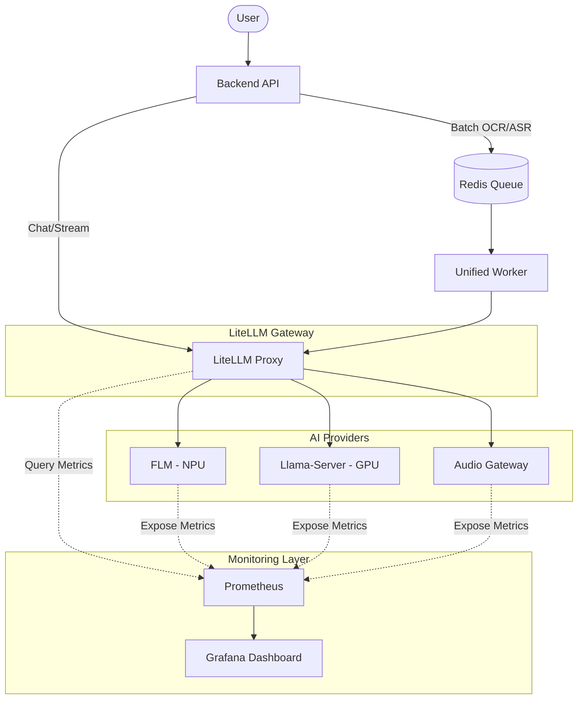

# Architecture V4: The One Gateway Strategy

**모든 AI 요청은 LiteLLM을 거칩니다.**
LiteLLM은 Prometheus를 통해 GPU/NPU 자원 상태를 실시간으로 확인하여 라우팅합니다.

## 시스템 구성도



---

## LiteLLM 라우팅 로직 (Prometheus 기반)

### 1. 자원 상태 확인
LiteLLM은 요청을 받으면 **Prometheus에 쿼리**하여 현재 자원 상태를 확인합니다:

```
PromQL 쿼리 예시:
- GPU 사용률: avg(gpu_utilization{device="GPU"})
- NPU 사용률: avg(npu_utilization{device="NPU"})
- 세마포어 상태: redis_key_exists{key="worker:gpu:active"}
```

### 2. 라우팅 결정
| 조건 | 라우팅 |
|---|---|
| GPU 사용률 > 80% | NPU (FLM)로 우회 |
| `worker:gpu:active` 존재 | NPU (FLM)로 우회 |
| NPU 사용률 > 80% | GPU (Llama)로 우회 |
| 모두 정상 | 기본 규칙 적용 |

### 3. 모니터링 대시보드
Grafana에서 실시간으로 확인 가능:
- 요청 수 (Chat/OCR/ASR)
- Provider별 응답 시간
- GPU/NPU 사용률
- 라우팅 결정 로그

---

## 요청 흐름: 동기 vs 비동기

### 실시간 요청 (동기)
| 요청 | 흐름 |
|---|---|
| **채팅** | Backend → LiteLLM → Prometheus 확인 → Provider → 응답 |
| **스트리밍 ASR** | Backend → LiteLLM → Prometheus 확인 → Audio Gateway → 실시간 응답 |

### 배치 요청 (비동기)
| 요청 | 흐름 |
|---|---|
| **파일 OCR** | Backend → Queue → Worker → LiteLLM → Prometheus 확인 → Provider → DB 저장 |
| **파일 ASR** | Backend → Queue → Worker → LiteLLM → Prometheus 확인 → Audio Gateway → DB 저장 |

---

## 통합 워커 역할

1. 작업 수신 (Queue에서 가져오기)
2. 전처리 (파일 다운로드, PDF→이미지)
3. AI 요청 위임 (LiteLLM 호출)
4. 후처리 및 저장 (DB/S3)
5. 상태 알림 (Redis Stream 발행)

---

## 라우팅 규칙

| 요청 | Mode | Provider |
|---|---|---|
| Chat | Speed | FLM (NPU) |
| Chat | Fallback | Llama-4B (GPU) |
| OCR | Speed | FLM (NPU) |
| OCR | Accuracy | Llama-8B (GPU On-Demand) |
| ASR Batch | Speed | FLM ASR (NPU) |
| ASR Batch | Accuracy | Insanely-Fast-Whisper (GPU) |
| ASR Stream | Speed | FLM Streaming (NPU) |
| ASR Stream | Accuracy | Whisper.cpp v3-turbo (Vulkan) |

---

## 핵심 포인트

1. **LiteLLM = 유일한 AI 관문**: 모든 AI 요청이 거쳐감
2. **Prometheus = 자원 상태 감시**: 실시간 메트릭 기반 라우팅
3. **Queue = 배치 작업 버퍼**: 무거운 작업의 비동기 처리
4. **Worker = 전처리 + API 호출**: 직접 추론 안 함, 위임만 함
5. **Grafana = 통합 대시보드**: 모든 메트릭 시각화
