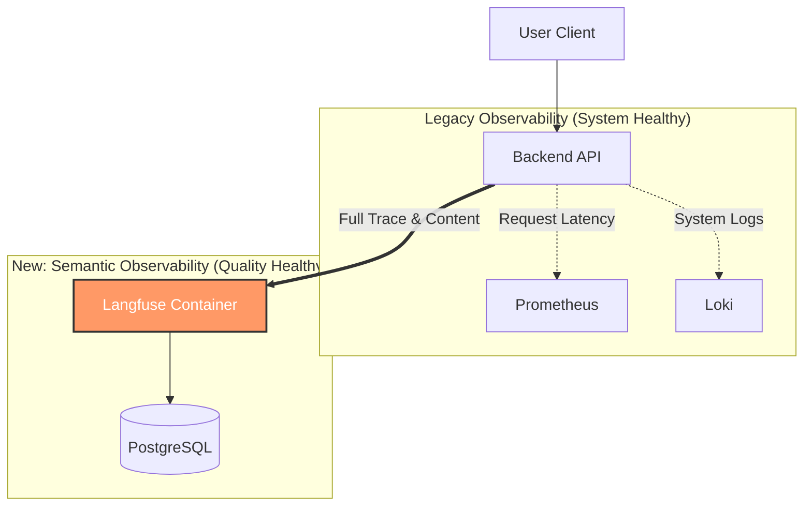
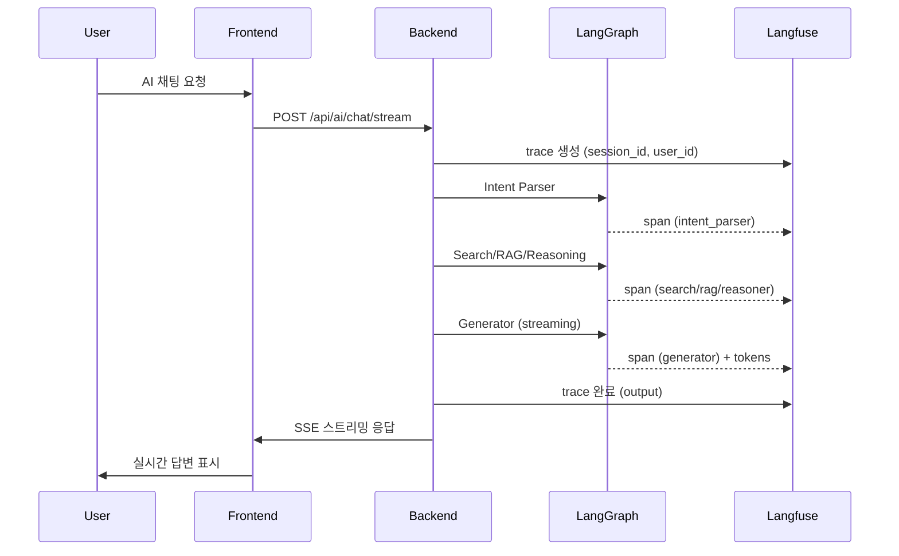

# LLM Observability 파이프라인 고도화: Langfuse 통합

> **Subject**: 블랙박스 상태인 LLM 서비스에 "의미론적 관측성(Semantic Observability)" 구축하기
> **Role**: Backend Engineer & DevOps
> **Date**: 2026-02-03

---

## 1. Problem Scenario (문제 상황)

### "성공했는데, 실패했습니다."
*   **현상**: 시스템 지표는 정상이지만, 사용자 만족도는 하락하는 괴리 발생
*   **System Status**: ✅ **Healthy** (HTTP 200 OK, Latency < 3s)
*   **User Feedback**: ❌ **Bad** ("요약 품질이 낮음", "환각 증세 발생")
*   **원인**: 기존 관측 도구(Loki, Prometheus)는 **"기능적 정상(Liveness)"**만 확인 가능, **"논리적 정상(Quality)"**은 확인 불가 (Blind Spot)

---

## 2. Attempted Solution (기존 시도)

### Phase 1: OpenLLMetry + Grafana
*   **접근**: 기존 인프라(Tempo/Grafana) 활용을 위해 `OpenLLMetry` 도입
*   **구현**: 10개 패널로 구성된 대시보드 구축

```
┌─────────────────────────────────────────────────────────────────┐
│                    LLM Observability Dashboard                  │
├─────────────────────────────────────────────────────────────────┤
│  [총 호출]  [평균 지연]  [오류율]  [활성 모델]                  │
├─────────────────────────────────────────────────────────────────┤
│  [시간대별 호출 추이]              [모델별 호출 분포]           │
├─────────────────────────────────────────────────────────────────┤
│  [지연 시간 히트맵]                [오류 유형 분포]             │
├─────────────────────────────────────────────────────────────────┤
│  [최근 LLM 트레이스 목록]                                       │
└─────────────────────────────────────────────────────────────────┘
```

### Analysis (한계점 분석)
*   대시보드는 예쁘지만, **"디버깅"**에 필요한 핵심 정보 누락

| 구분 | Tempo/Grafana 데이터 | 실제 필요한 데이터 | 상태 |
| :--- | :--- | :--- | :--- |
| **Input** | `POST /chat/completions` | **User Prompt** ("회의록 요약해줘...") | ❌ 확인 불가 |
| **Output** | `200 OK` | **LLM Response** ("요약 결과는...") | ❌ 확인 불가 |
| **Cost** | N/A | **Token Cost** ($0.002) | ❌ 산출 불가 |

> **Retrospective**: "기존 APM은 서버의 **'건강 상태'**를 보는 청진기일 뿐, 대화의 **'맥락'**을 이해하는 통역사가 아님."

---

## 3. Clues for Improvement (개선 단서)

단순 로그가 아닌 **"상태를 가진 실행 흐름(Stateful Execution Flow)"** 추적 필요

*   **Context Aware**: 단순 I/O가 아닌 프롬프트 템플릿 버전과 파라미터 매핑 필요
*   **Token Economics**: 요청 횟수가 아닌, 토큰 기반의 실시간 비용 산출 필요
*   **Human-in-the-loop**: 개발자가 응답을 보고 "좋음/나쁨"을 마킹할 수 있는 피드백 루프 필수

---

## 4. Direction of Improvement (개선 방향)

### "Service Observability" → "Semantic Observability"
시스템 중심 모니터링에서 **데이터/컨텐츠 중심 관측성**으로 패러다임 전환

*   **Architecture Change**: LLM 전용 관측 레이어(Langfuse) 추가
*   **Integration**: `LangGraph` Callback 시스템을 활용한 비침투적(Non-intrusive) 연동

### Target Architecture



---

## 5. Improvement Goals (개선 목표)

### Quantitative Goals (정량적 목표)
*   **Debug Time**: 환각 이슈 리포트 시 원인 파악 **10분 → 30초** 단축 (Trace ID로 즉시 전문 확인)
*   **Cost Visibility**: 일별/모델별 토큰 비용 오차 범위 **1% 미만** 달성
*   **Overhead**: 로깅으로 인한 API Latency 증가 **< 5ms** (Async Batch 처리)

### Qualitative Goals (정성적 목표)
*   **Data-Driven**: "감"이 아닌 "데이터" 기반의 프롬프트 엔지니어링 수행
*   **Feedback Loop**: `테스트` → `배포` → `모니터링` → `개선`의 선순환 LLM Ops 완성

---

## 6. Implementation Plan (구현 상세)

### Step 1: Self-Hosted Infrastructure
외부 데이터 유출 방지를 위한 Docker Compose 기반 내부망 구축. 최신 기능을 활용하기 위해 `latest` 태그 사용.

```yaml
services:
  langfuse:
    image: langfuse/langfuse:latest
    environment:
      - DATABASE_URL=postgresql://...
    ports: ["3000:3000"]
```

### Step 2: LangGraph Integration
Decorator Pattern을 활용, 비즈니스 로직 침투 최소화

```python
# 기존 코드 수정 없이 데코레이터로 관측성 주입
@observe()
async def chat_pipeline(input_data):
    return await graph.ainvoke(input_data, config={"callbacks": [handler]})
```

---

## 7. Role Redefinition (역할 재정의)

기존 모니터링 도구와 새로운 도구의 역할을 명확히 구분하여 상호 보완적인 체계 구축

| 도구 | 역할 | 데이터 소스 | 핵심 질문 |
| :--- | :--- | :--- | :--- |
| **Grafana** (Legacy) | **System Monitor** | Tempo, Prometheus | "서버가 *언제* 느려지는가?" |
| **Langfuse** (New) | **Quality Monitor** | Langfuse DB | "AI가 *왜* 이상한 말을 하는가?" |

> **Strategy**: Grafana 알림으로 이상 징후 감지 → Langfuse로 상세 원인 분석

---

## 8. Before vs After (도입 전후 비교)

### Before (System-Centric)
*   **로그**: `POST /chat 200 OK (2.3s)`
*   **디버깅**: "로그에 에러 없는데요? 모델 문제인 것 같습니다." (추측 기반)
*   **비용**: 월말 청구서가 나와야 확인 가능
*   **운영**: 사용자 신고가 들어와야 문제 인지

### After (Data-Centric)
*   **로그**: `User="요약해줘"`, `AI="네, 요약문은..."`, `Token=450`
*   **디버깅**: "Trace ID 1234번 보니 프롬프트에 오타가 있었네요." (팩트 기반)
*   **비용**: 대시보드에서 모델별 실시간 소진 현황 확인
*   **운영**: 낮은 품질 점수(Score < 0.5) 발생 시 즉시 알림

---

## 9. Verification Criteria (검증 기준)

성공적인 도입 판단을 위한 체크리스트

1.  **데이터 정합성 (Integrity)**
    *   [ ] 실제 발생한 API 호출 수와 Langfuse에 기록된 Trace 수가 일치하는가?
    *   [ ] 프롬프트 및 응답 본문이 잘림 없이 100% 저장되는가?

2.  **비용 정확성 (Accuracy)**
    *   [ ] `gpt-4o` 등 상용 모델의 토큰 비용이 OpenAI 대시보드와 ±1% 이내인가?

3.  **시스템 영향도 (Stability)**
    *   [ ] Langfuse 컨테이너가 다운되어도 메인 비즈니스 로직은 정상 동작하는가? (Fail-safe)
    *   [ ] 로깅으로 인한 Latency 증가폭이 5ms 이하인가?

---

## 10. Implementation Status (구현 완료 상태)

### ✅ 완료된 작업 (2026-02-04)

#### Infrastructure Setup
*   **Langfuse Container**: Self-hosted v2 커스텀 이미지 (`/langfuse` base path)
*   **Database**: PostgreSQL 전용 DB (`langfuse`) 생성
*   **Nginx Proxy**: `/langfuse/` 경로로 프록시 설정
*   **Healthcheck**: IPv4 바인딩 및 healthcheck 수정 (healthy 상태 달성)
*   **환경변수**: `LANGFUSE_HOST`, `LANGFUSE_PUBLIC_KEY`, `LANGFUSE_SECRET_KEY` 설정

#### Backend Integration
*   **Core Module** (`app/core/langfuse.py`):
    *   `get_langfuse_handler()` - LangChain/LangGraph 콜백 핸들러
    *   `get_langfuse_client()` - 직접 API 호출용 클라이언트
    *   `is_langfuse_enabled()` - 환경변수 기반 활성화 제어
    *   Fail-safe 설계: Langfuse 장애 시에도 메인 로직 정상 동작

*   **AI Agent Integration** (`app/agents/graph.py`):
    *   ✅ `run_ai_agent()`: LangGraph callbacks 시스템으로 자동 트레이싱
    *   ✅ `stream_ai_agent()`: 수동 trace/span 생성으로 스트리밍 트레이싱
        *   메인 Trace: 요청/응답, 모드, 티어 정보 기록
        *   Intent Parser Span: 의도 분석 결과
        *   Search Spans: 웹 검색, RAG 검색, Hybrid 검색 결과
        *   Reasoner Span: 추론 모드 응답
        *   Generator Span: 최종 응답 생성
    *   Session tracking: `conversation_id`를 `session_id`로 매핑
    *   Metadata: 검색 결과 수, 모드, 티어 등 컨텍스트 정보 포함

#### Frontend Integration
*   **Monitoring Dashboard** (`client/app/monitoring/page.tsx`):
    *   "LLM 분석" 탭 추가: `/langfuse/` 경로
    *   External link로 새 창 열기 (Grafana와 분리)
    *   Brain 아이콘으로 시각적 구분

#### Access & Authentication
*   **초기 계정**: `admin@torch.local` / `changeme`
*   **Project**: `torch` org, `ai-chat` project
*   **API Keys**: `pk-lf-torch-dev` / `sk-lf-torch-dev`

### 📊 수집되는 데이터

| 항목 | 내용 | 용도 |
| :--- | :--- | :--- |
| **Traces** | AI 채팅 요청 전체 실행 흐름 | 워크플로우 전체 추적 |
| **Spans** | Intent, Search, Generation 각 단계 | 단계별 성능 분석 |
| **Input** | 사용자 쿼리, 모드 | 쿼리 패턴 분석 |
| **Output** | AI 응답, 선택된 티어 | 품질 평가 |
| **Metadata** | 검색 결과 수, 소스 정보 | 컨텍스트 분석 |
| **Session** | `conversation_id` | 대화별 그룹핑 |
| **Tags** | `ai-chat-mode`, `streaming`, `mode:search` | 필터링/분류 |

### 🔄 동작 흐름



### 🎯 다음 단계 (추후 작업)

*   [ ] 사용자 인증 구현 후 실제 `user_id` 전달
*   [ ] Langfuse Score API 연동 (사용자 피드백 수집)
*   [ ] 프롬프트 템플릿 버전 관리 (Langfuse Prompt Management)
*   [ ] 토큰 비용 추적 및 월별 리포트 생성
*   [ ] A/B 테스트: 프롬프트/모델 변경 효과 측정
*   [ ] 품질 저하 알림: Score < 0.5 시 Slack 알림
